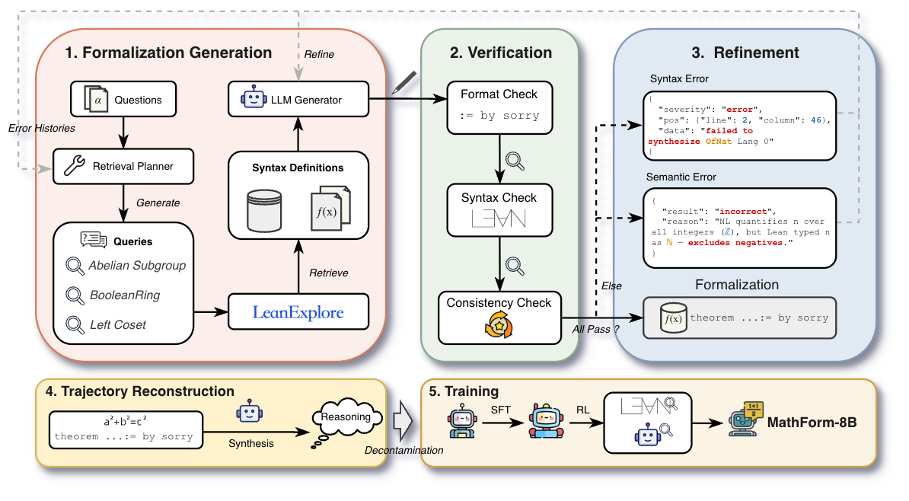
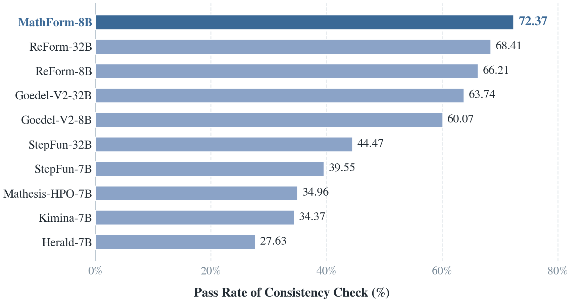

<div align="center">
  <h1>MathForm: Scaling Mathematical Autoformalization with Knowledge Retrieval and Verification-Guided Refinement</h1>
</div>

<p align="center">
  <a href="https://arxiv.org/abs/2608.14221"></a>
  <a href="https://huggingface.co/datasets/openbmb/FormalVerse"></a>
  <a href="https://huggingface.co/openbmb/MathForm-8B"></a>
</p>

<p align="center">
  
  <br>
  <em>Figure 1: Overview of the MathForm data construction and training pipeline. The system combines Mathlib knowledge retrieval, compilation and semantic verification, and iterative refinement to generate reliable formal data, followed by trajectory reconstruction and training of MathForm-8B.</em>
</p>

## 📖 Introduction

We introduce **MathForm**, an autoformalization framework that combines
knowledge retrieval from Mathlib with verification-guided iterative refinement.
MathForm retrieves relevant definitions and existing formalizations before
generation, then uses compiler diagnostics and semantic-consistency feedback to
refine generated Lean statements.

Using this framework, we construct
[**FormalVerse**](https://huggingface.co/datasets/openbmb/FormalVerse), a
verified Lean 4 dataset covering diverse mathematical domains and sources. We
also train [**MathForm-8B**](https://huggingface.co/openbmb/MathForm-8B) with
supervised fine-tuning followed by reinforcement learning using Lean compilation
and semantic-consistency feedback. The released code supports the data construction pipeline and
autoformalizer evaluation.

<p align="center">
  
  <br>
  <em>Figure 2: Macro-average Pass@8 (%) across FormalMATH-Lite, ProverBench, CombiBench, FATE-M, FATE-H, and FATE-X among specialized autoformalizers. MathForm-8B achieves the strongest overall performance within this category despite its smaller model size.</em>
</p>

## News

- **`[2026.08.17]`**: MathForm [paper](https://arxiv.org/abs/2608.14221), [code](https://github.com/OpenBMB/MathForm), [data](https://huggingface.co/datasets/openbmb/FormalVerse) and [model](https://huggingface.co/openbmb/MathForm-8B) are released. 🔥🔥🔥

## 📁 Repository Structure

```text
src/                         Data construction pipeline
evaluation/                  Evaluation pipeline and benchmark files
kimina-lean-server/          Lean compilation server source
assets/                      Figures used in this README
requirements.txt             Python dependencies
```

## 🛠️ Quick Start

### Installation

1. Clone the repository:

```bash
git clone https://github.com/OpenBMB/MathForm.git
cd MathForm
```

2. Install the Python dependencies:

```bash
pip install -r requirements.txt
```

The experiments use Lean 4.21.0.

### Start Kimina Lean Server

The evaluation and data-construction pipelines require a running Kimina Lean
Server for compilation checks.

```bash
cd kimina-lean-server
cp .env.template .env
bash setup.sh
pip install -r requirements.txt
pip install .
prisma generate
python -m server
```

The default endpoint is `http://localhost:8000`.

### Run Data Construction

The input is a JSONL file containing a natural-language statement in a field
such as `statement` or `informal_statement`.

```bash
cd src
API_URL=https://api.example.com/v1/chat/completions \
API_KEY="$API_KEY" \
BASE_MODEL_NAME=[GENERATION_MODEL] \
JUDGE_MODEL_NAME=[JUDGE_MODEL] \
LEAN_SERVER_URL=http://localhost:8000 \
bash run.sh path/to/input.jsonl output/run
```

Start Lean Explore with `run_leanexp_server.sh` and add:

```bash
LEAN_EXPLORE_URL=http://localhost:9000
```

The generated files include `success.jsonl`, `failed.jsonl`, and
`pipeline.log`. Successful samples can be normalized and filtered with:

```bash
python postprocess.py normalize \
  --input output/run/success.jsonl \
  --output output/run/normalized.jsonl
python postprocess.py filter \
  --input output/run/normalized.jsonl \
  --output output/run/filtered.jsonl
```

### Run Evaluation

The default evaluation uses the benchmark files under
`evaluation/benchmarks/`.

```bash
cd evaluation
EVAL_API_BASE_URL=https://api.example.com/v1 \
EVAL_API_MODEL=[EVALUATION_MODEL] \
JUDGE_API_BASE_URL=https://api.example.com/v1 \
JUDGE_API_MODEL=[JUDGE_MODEL] \
API_KEY="$API_KEY" \
bash run.sh
```

Results are written to `evaluation/output/`:

```text
predictions.jsonl       Generated Lean candidates
results.jsonl           Compilation and judge results
results.compile.jsonl   Compilation cache
results.summary.json    Pass@k summary
```

To evaluate another benchmark or change the number of samples, set
`DATASET_PATHS` or `NUM_SAMPLES` before running `run.sh`.

## 🔎 Citation

If you find this repository useful, please cite our paper:

```bibtex
@misc{pu2026mathformscalingmathematicalautoformalization,
      title={MathForm: Scaling Mathematical Autoformalization with Knowledge Retrieval and Verification-Guided Refinement},
      author={Lushi Pu and Weiming Zhang and Xinheng Xie and Zixuan Fu and Bingxiang He and Hengyu Zhao and Hongya Lyu and Xin Li and Jie Zhou and Yudong Wang},
      year={2026},
      eprint={2608.14221},
      archivePrefix={arXiv},
      primaryClass={cs.AI},
      url={https://arxiv.org/abs/2608.14221},
}
```

## 🤝 Acknowledgement

This repository builds on the following open-source projects:

- [Kimina Lean Server](https://github.com/project-numina/kimina-lean-server) for Lean compilation checks.
- [Lean Explore](https://github.com/justincasher/lean-explore) for retrieval.

The evaluation uses the following benchmarks:

- [FormalMATH-Lite](https://huggingface.co/datasets/SphereLab/FormalMATH-Lite)
- [ProverBench](https://huggingface.co/datasets/deepseek-ai/DeepSeek-ProverBench)
- [CombiBench](https://huggingface.co/datasets/AI-MO/CombiBench)
- [FATE-M](https://github.com/frenzymath/FATE-M/tree/main)
- [FATE-H](https://github.com/frenzymath/FATE-H/tree/main)
- [FATE-X](https://github.com/frenzymath/FATE-X/tree/main)

Part of the informal problems used to build FormalVerse are drawn from the
following open collections:

- [Lean-Workbook](https://huggingface.co/datasets/pkuAI4M/LeanWorkbook)
- [NuminaMath](https://huggingface.co/datasets/AI-MO/NuminaMath-1.5)
- [DeepMath](https://huggingface.co/datasets/zwhe99/DeepMath-103K)
- [DeepTheorem](https://huggingface.co/datasets/Jiahao004/DeepTheorem)
- [AceReason-Math](https://huggingface.co/datasets/nvidia/AceReason-Math)
- [OpenR1-Math](https://huggingface.co/datasets/open-r1/OpenR1-Math-220k)
- [Principia-Collection](https://huggingface.co/datasets/facebook/principia-collection)

We thank the authors and contributors of these projects.

## 📜 License

This project is licensed under the Apache License 2.0. The bundled third-party
components retain their original license and attribution notices.
